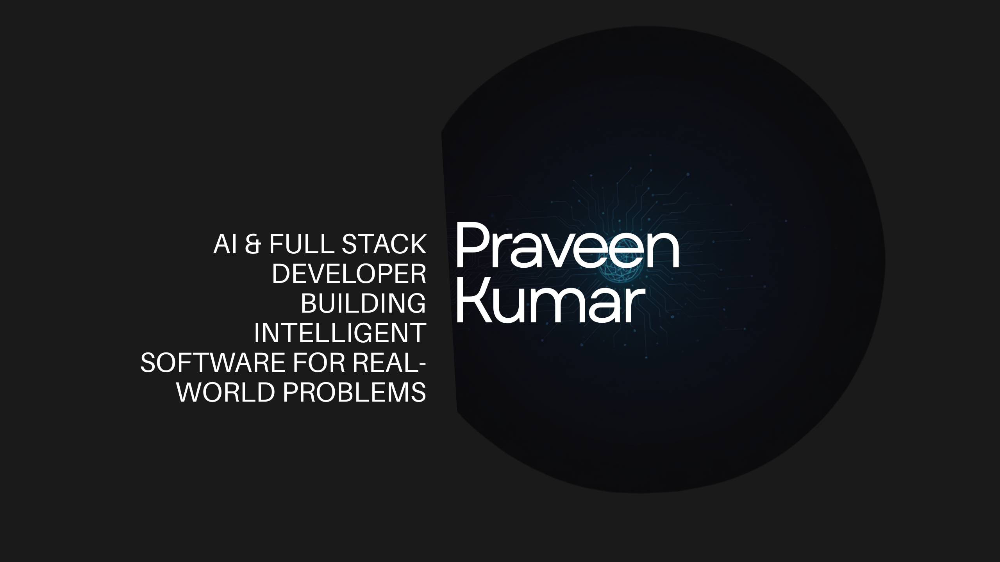

  

<h1 align="center">Hi 👋, I'm Praveen Kumar</h1>

<h3 align="center">
AI & Full Stack Developer • India 🇮🇳
</h3>

Passionate about building AI-powered applications, scalable backend systems, and modern web solutions that solve real-world problems.

  

  

---

# 👨‍💻 About Me

I'm **Praveen Kumar**, an **AI & Full Stack Developer** from India with a background in **Electronics and Communication Engineering (ECE)**.

I enjoy building intelligent software that solves real-world problems by combining **Artificial Intelligence**, **Backend Development**, and **Modern Web Technologies**.

I believe the best way to learn is by building projects, continuously improving, and exploring new technologies.

Currently, I'm expanding my knowledge in AI-powered applications, scalable backend systems, cloud technologies, and software architecture.

- 🎓 B.Tech in Electronics and Communication Engineering
- 💻 Passionate about AI, Backend Development & Full Stack Engineering
- 🚀 Currently building real-world AI applications
- 🌱 Learning Node.js, Express.js, Docker & System Design
- 🎯 Goal: Become an AI Engineer / Full Stack Developer building impactful software

---

## 💻 Tech Stack

<table>
<tr>
<td valign="top" width="50%">

### 🚀 Languages

### 🌐 Frontend

### ⚙️ Backend

</td>

<td valign="top" width="50%">

### 🗄️ Database

### 🛠️ Tools

### 🤖 AI / ML

- PyTorch
- NumPy
- OpenAI API
- Prompt Engineering
- Diffusion Models (DDPM)

</td>
</tr>
</table>

---

## 🚀 Featured Projects

### 🧠 Brain Tumor Segmentation using Diffusion Models

> Developed a deep learning solution using a **3D Conditional Diffusion Probabilistic Model (DDPM)** for automated brain tumor segmentation from MRI datasets.

**Tech Stack**

`Python` `PyTorch` `NumPy`

---

### ✨ AI Story Generator

> AI-powered web application that generates creative stories using the **OpenAI API**, asynchronous request handling, and a responsive interface.

**Tech Stack**

`HTML` `CSS` `JavaScript` `OpenAI API`

---

### 🔐 Smart Door Lock System

> Arduino-based smart security system featuring password authentication and automatic lockout after multiple failed attempts.

**Tech Stack**

`Arduino` `Embedded Systems`

---

> 🚧 **Currently Building**

- AI Voice Agent
- HELPON
- AI-powered Applications

---

## 📊 GitHub Analytics

  

  

---

## 🔥 GitHub Streak

---

## 📈 Contribution Graph

---

## 📚 Currently Learning

- 🤖 AI Agents & Large Language Models (LLMs)
- 🎙️ AI Voice Applications
- ⚙️ Backend Architecture
- 🐳 Docker
- ☁️ Cloud Technologies
- 🏗️ System Design

---

## 🎯 2026 Goals

- 🚀 Build production-ready AI applications
- 🌐 Develop scalable full-stack systems
- 📖 Contribute to open-source projects
- 💼 Start my career as an AI / Full Stack Developer
- 📚 Continue learning modern software engineering practices

---

## 📫 Connect With Me

---

---

⭐ **Building Intelligent Software for Real-World Problems**

Thank you for visiting my GitHub profile!

